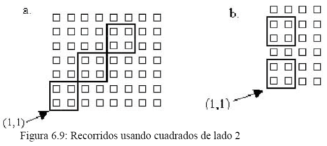
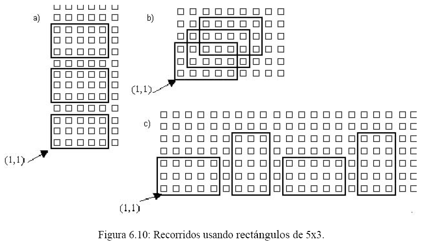

### 1. Escriba un proceso que le permita al robot realizar un cuadrado de lado 2 girando en la dirección de las agujas del reloj.
```
proceso girar
comenzar
  repetir 4
    repetir 2
      mover
    derecha
fin
```
##
### 2. Utilice el proceso desarrollado en 1. para realizar un programa para cada uno de los recorridos de la figura 6.9.


### a
```
robot robot1
comenzar
  girar
  Pos(3,3)
  girar
  Pos(5,5)
  girar
fin
```
### b
```
robot robot1
comenzar
  girar
  Pos(1,4)
  girar
fin
```
##
### 3. Escriba un proceso que le permita al robot realizar un rectángulo de base 5 y altura 3 girando en la dirección de las agujas del reloj a partir de la posición (1,1).
```
proceso rectangulo3x5
comenzar
  repetir 2
    repetir 3
      mover
    derecha
    repetir 5
      mover
    derecha
fin
```
##
### 4. Programe al Robot para que realice los recorridos de la figura 6.10 utilizando el proceso desarrollado en 3.

### a
```
robot robot1
comenzar
  rectangulo3x5
  Pos(1, 5)
  rectangulo3x5
  Pos(1, 9)
  rectangulo3x5
fin
```
### b
```
robot robot1
variables
  actual: numero
comenzar
  actual := 1

  repetir 3
    Pos(actual, actual)
    rectangulo3x5
    actual := actual + 1
fin
```
### c
```
proceso rectangulo5x3
comenzar
  repetir 2
    repetir 5
      mover
    derecha
    repetir 3
      mover
    derecha
fin

robot robot1
variables
  avenida: numero
comenzar
  avenida := 1

  repetir 2
    Pos(avenida, 1)
    rectangulo3x5
    avenida := avenida + 6
    
    Pos(avenida, 1)
    rectangulo5x3
    avenida := avenida + 4
fin
```
##
### 5. Rehacer el recorrido del ejercicio 4.c) trasladando los papeles de cada esquina correspondientes a un lado del rectángulo al vértice siguiente en el recorrido. Por ejemplo, para el rectángulo con vértice en (1,1), los papeles de (1,2) y (1,3) deben ser trasladados a (1,4); los de la calle 4 entre las avenidas 2 y 6 deben ser reubicados en (6,4); y así siguiendo.
```
proceso juntarPapeles
comenzar
  mientras (HayPapelEnLaEsquina)
    tomarPapel
fin

proceso dejarPapeles
comenzar
  mientras (HayPapelEnLaBolsa)
    depositarPapel
fin

proceso rectangulo3x5juntaPapeles
comenzar
  repetir 2
    mover
    repetir 2
      juntarPapeles
      mover
    dejarPapeles
    derecha

    mover
    repetir 4
      juntarPapeles
      mover
    dejarPapeles
    derecha
fin

proceso rectangulo5x3juntaPapeles
comenzar
  repetir 2
    mover
    repetir 4
      juntarPapeles
      mover
    dejarPapeles
    derecha

    mover
    repetir 2
      juntarPapeles
      mover
    dejarPapeles
    derecha
fin

robot robot1
variables
  avenida: numero
comenzar
  avenida := 1

  repetir 2
    Pos(avenida, 1)
    rectangulo3x5juntaPapeles
    avenida := avenida + 6
    
    Pos(avenida, 1)
    rectangulo5x3juntaPapeles
    avenida := avenida + 4
fin
```
##
### 6. (a) Escriba un proceso que le permita al robot realizar un rectángulo de base 5 y altura 3 girando en la dirección contraria a la de las agujas del reloj.
```
proceso izquierda
comenzar
  repetir 3
    derecha
fin

proceso rectangulo3x5antihorario
comenzar
  repetir 2
    repetir 3
      mover
    izquierda
    repetir 5
      mover
    izquierda
fin
```
##
### 6. (b) Indique si se produce alguna modificación en los procesos de los ejercicios 4 y 5 si se reemplaza el módulo realizado en 3 por el implementado en 6.a.

  El robot girará hacia la izquierda por lo que el posicionamiento debe ser ajustado para evitar salirse de la ciudad.
  
##
### 7. (a) Escriba el proceso LimpiarEsquina que le permita al robot recoger todas las flores y todos los papeles de la esquina donde se encuentra parado.
```
proceso LimpiarEsquina
comenzar
  mientras (HayFlorEnLaEsquina)
    tomarFlor
  mientras (HayPapelEnLaEsquina)
    tomarPapel
fin
```
##
### 7. (b) Escriba un programa que le permita al robot recoger todas las flores y papeles de la avenida 89, utilizando el proceso implementado en 7a).
```
robot robot1
comenzar
  Pos(89, 1)
  repetir 99
    LimpiarEsquina
    mover
fin
```
##
### 7. (c) Modifique el proceso 6.a) para que el robot realice el rectángulo indicado dejando a su paso todas las esquinas vacías. Para hacerlo debe utilizar el proceso LimpiarEsquina.
```
proceso rectangulo3x5antihorarioLimpiador
comenzar
  repetir 2
    repetir 3
      LimpiarEsquina
      mover
    izquierda
    repetir 5
      LimpiarEsquina
      mover
    izquierda
fin
```
##
### 7. (d) Rehacer el recorrido 4.b) utilizando el proceso definido en 7.c)
```
robot robot1
variables
  actual: numero
comenzar
  actual := 1

  repetir 3
    Pos(actual, actual)
    rectangulo3x5antihorarioLimpiador
    actual := actual + 1
fin
```
##
### 8. Programe al robot para que recorra la ciudad de la siguiente manera: primero debe recorrer la avenida 1 juntando todas las flores que encuentre, luego debe recorrer la calle 1 juntando todos los papeles que encuentre. Luego recorre la avenida 2 y la calle 2 de la misma manera y así siguiendo. Implemente un módulo para recorrer la avenida y otro módulo para recorrer la calle.
```
proceso izquierda
comenzar
  repetir 3
    derecha
fin

proceso juntarFlores
comenzar
  mientras (HayFlorEnLaEsquina)
    tomarFlor
fin

proceso juntarPapeles
comenzar
  mientras (HayPapelEnLaEsquina)
    tomarPapel
fin

proceso RecorrerAvenida
comenzar
  repetir 99
    juntarFlores
    mover
  juntarFlores
fin

proceso RecorrerCalle
comenzar
  repetir 99
    juntarPapeles
    mover
  juntarPapeles
fin

robot robot1
variables
  actual: numero
comenzar
  actual := 1
  repetir 100
    Pos(actual, 1)
    RecorrerAvenida
    derecha

    Pos(1, actual)
    RecorrerCalle
    izquierda

    actual := actual + 1
fin

```
##
### 9. Realice un programa que le permita al robot recorrer las avenidas pares de la ciudad. Cada avenida debe recorrerse hasta encontrar una esquina con al menos 3 flores (la esquina seguro existe). MODULARICE.
```
proceso recorrerAvPar
variables
  floresEsq: numero
comenzar
  floresEsq := 0
  mientras (floresEsq < 3)
    floresEsq := 0
    mientras(HayFlorEnLaEsquina)
      tomarFlor
      floresEsq := floresEsq + 1
    mover
fin

robot robot1
variables
  avenida: numero
comenzar
  avenida := 2
  repetir 50
    Pos(avenida, 1)
    recorrerAvPar
    avenida := avenida + 2
fin
```